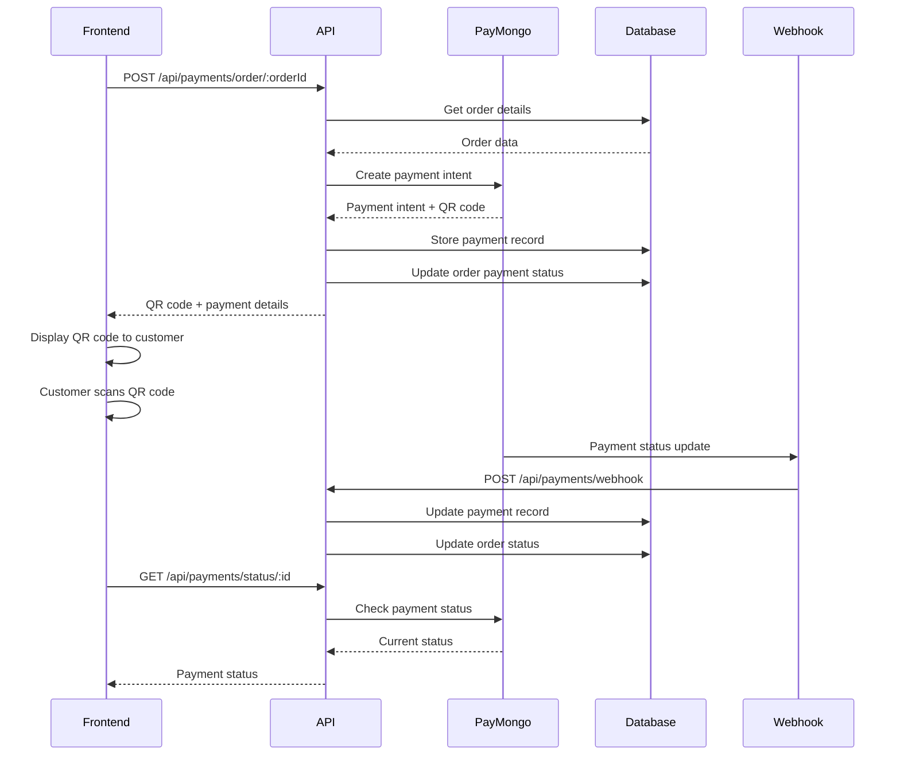

# PayMongo Payment Flow Analysis

## 🔍 **Complete Payment System Analysis**

### **1. PayMongo Service (`paymongoService.ts`)**

#### **QR Code Generation Process:**
```typescript
createPaymentIntent() → createQRPhPaymentMethod() → extractQRPhCodeData()
```

**Key Features:**
- ✅ **QR Ph Integration**: Supports Philippine QR payment standard
- ✅ **Mock Mode**: `PAYMONGO_MOCK_MODE=true` for testing
- ✅ **Test/Live Mode**: Configurable via `PAYMONGO_TEST_MODE`
- ✅ **Webhook Support**: Handles payment status updates
- ✅ **Error Handling**: Comprehensive error logging and fallbacks

**QR Code Generation Flow:**
1. **Create Payment Intent** → PayMongo API call
2. **Create QR Ph Payment Method** → Generate QR payment method
3. **Attach to Payment Intent** → Link QR method to intent
4. **Extract QR Data** → Get base64 QR code image
5. **Return QR Code** → URL and data for frontend display

#### **Webhook Processing:**
- `payment.paid` → Mark as paid
- `payment.failed` → Mark as failed  
- `payment_intent.cancelled` → Mark as cancelled
- `qrph.expired` → Revert to pending

---

### **2. Payment Routes (`paymentRoutes.ts`)**

#### **Available Endpoints:**

**A. General Payment Creation:**
```
POST /api/payments/create
POST /api/payments/order/:orderId
```

**B. Payment Management:**
```
GET /api/payments/status/:paymentIntentId
POST /api/payments/:paymentIntentId/cancel
GET /api/payments/order/:orderId/history
```

**C. Admin Configuration:**
```
GET /api/payments/admin/methods
PUT /api/payments/admin/methods/:methodKey/toggle
GET /api/payments/methods/available
```

#### **Order Payment Integration:**
```typescript
// Order-specific payment creation
POST /api/payments/order/:orderId
{
  "description": "Payment for Order #12345",
  "metadata": { "custom": "data" }
}
```

**Process:**
1. **Validate Order** → Check if order exists and not already paid
2. **Calculate Amount** → Convert peso to centavos (×100)
3. **Create Payment Intent** → Call PayMongo service
4. **Store Payment Record** → Save to `payments` table
5. **Update Order** → Set payment method and status

---

### **3. Order Routes Integration (`orderRoutes.ts`)**

#### **PayMongo Order Payment:**
```
POST /api/orders/:orderId/paymongo-payment
```

**Enhanced Features:**
- ✅ **Order Validation** → Ensures order exists and not paid
- ✅ **Amount Calculation** → Automatic conversion to centavos
- ✅ **Payment Record Creation** → Links payment to order
- ✅ **Order Status Update** → Updates order payment status
- ✅ **Manual Sync** → `POST /api/orders/:orderId/sync-payment`

#### **Payment Status Sync:**
```typescript
// Manual payment status synchronization
POST /api/orders/:orderId/sync-payment
```

**Sync Process:**
1. **Get Latest Payment** → Fetch from `payments` table
2. **Check PayMongo Status** → Query PayMongo API
3. **Compare Statuses** → Determine if update needed
4. **Update Order** → Change payment status if different
5. **Update Payment Record** → Store latest PayMongo data

---

### **4. Database Schema Analysis (`latest.sql`)**

#### **Payment-Related Tables:**

**A. `orders` Table:**
```sql
payment_status: 'unpaid' | 'paid' | 'refunded' | 'pending' | 'failed' | 'cancelled'
payment_method: 'cash' | 'gcash' | 'card' | 'paymongo' | 'qrph'
```

**B. `payments` Table:**
```sql
-- Main payment tracking table
payment_intent_id: string (unique)
order_id: uuid (FK to orders.id)
amount: numeric (in centavos)
status: payment_intent_status
payment_status: payment_status
payment_method: payment_method
qr_code_url: string
qr_code_data: text
paymongo_response: jsonb
webhook_events: jsonb[]
```

**C. `paymongo_payments` Table:**
```sql
-- Legacy PayMongo-specific table (may be redundant)
order_id: uuid (FK to orders.id)
payment_intent_id: string
amount: numeric
status: string
qr_code_url: string
```

**D. `payment_methods_config` Table:**
```sql
-- Payment method configuration
method_key: 'paymongo' | 'cash' | 'gcash' | etc.
is_enabled: boolean
is_online: boolean
requires_setup: boolean
```

#### **Key Relationships:**
- `payments.order_id` → `orders.id` (One-to-One)
- `payments.created_by` → `user_profiles.id` (Many-to-One)
- `orders.payment_method` → `payment_methods_config.method_key` (Logical)

---

### **5. Complete Payment Flow**

#### **🔄 End-to-End Payment Process:**



#### **📋 Step-by-Step Process:**

**1. Payment Initiation:**
- Customer places order
- Cashier selects "PayMongo" payment method
- System calls `POST /api/payments/order/:orderId`

**2. QR Code Generation:**
- PayMongo service creates payment intent
- Generates QR Ph payment method
- Extracts base64 QR code image
- Returns QR code URL and data

**3. Payment Processing:**
- Customer scans QR code with mobile banking app
- PayMongo processes payment
- Sends webhook to system
- Updates payment and order status

**4. Receipt Generation:**
- System marks order as paid
- Generates receipt with payment details
- Updates inventory (if configured)

---

### **6. Key Features & Capabilities**

#### **✅ Working Features:**
- **QR Code Generation** → PayMongo QR Ph integration
- **Order Integration** → Automatic amount calculation
- **Payment Tracking** → Complete payment history
- **Webhook Processing** → Real-time status updates
- **Manual Sync** → Backup status synchronization
- **Admin Controls** → Payment method configuration
- **Error Handling** → Comprehensive error management

#### **🔧 Configuration Options:**
- **Mock Mode** → `PAYMONGO_MOCK_MODE=true` for testing
- **Test Mode** → `PAYMONGO_TEST_MODE=true` for sandbox
- **Payment Methods** → Configurable via admin panel
- **Webhook Security** → Signature validation (production)

#### **📊 Data Flow:**
```
Order → Payment Intent → QR Code → Customer Payment → Webhook → Status Update → Receipt
```

---

### **7. Receipt Generation**

#### **Payment Data Available for Receipt:**
- **Order Details**: Order number, items, total amount
- **Payment Details**: Payment method, transaction ID, timestamp
- **Customer Info**: Name, phone (if provided)
- **QR Code**: For reference/verification

#### **Receipt Endpoints:**
```typescript
// Get payment history for receipt
GET /api/payments/order/:orderId/history

// Get order with payment details
GET /api/orders/:orderId
```

---

### **8. Security & Best Practices**

#### **✅ Implemented:**
- **Authentication** → Admin/cashier role validation
- **Input Validation** → Amount, order ID validation
- **Error Logging** → Comprehensive error tracking
- **Webhook Validation** → Signature verification (configurable)

#### **🔒 Production Considerations:**
- **Webhook Security** → Enable signature validation
- **Rate Limiting** → Implement API rate limits
- **Data Encryption** → Sensitive data encryption
- **Audit Logging** → Payment audit trail

---

### **9. Testing & Debugging**

#### **Test Endpoints:**
```bash
# Test payment creation
POST /api/payments/create
{
  "amount": 10000,
  "description": "Test Payment"
}

# Test order payment
POST /api/payments/order/:orderId
{
  "description": "Test Order Payment"
}

# Test payment status
GET /api/payments/status/:paymentIntentId

# Test manual sync
POST /api/orders/:orderId/sync-payment
```

#### **Mock Mode Testing:**
```bash
# Enable mock mode for testing
PAYMONGO_MOCK_MODE=true
PAYMONGO_TEST_MODE=true
```

---

## 🎯 **Summary**

The payment system is **well-architected** with:

1. **Complete PayMongo Integration** → QR Ph support, webhooks, status tracking
2. **Robust Order Integration** → Automatic amount calculation, status updates
3. **Comprehensive Database Design** → Proper relationships, payment tracking
4. **Admin Controls** → Payment method configuration, manual sync
5. **Error Handling** → Comprehensive logging and fallbacks
6. **Testing Support** → Mock mode, test endpoints

The system is **production-ready** with proper security, error handling, and comprehensive payment tracking from QR generation to receipt delivery.
